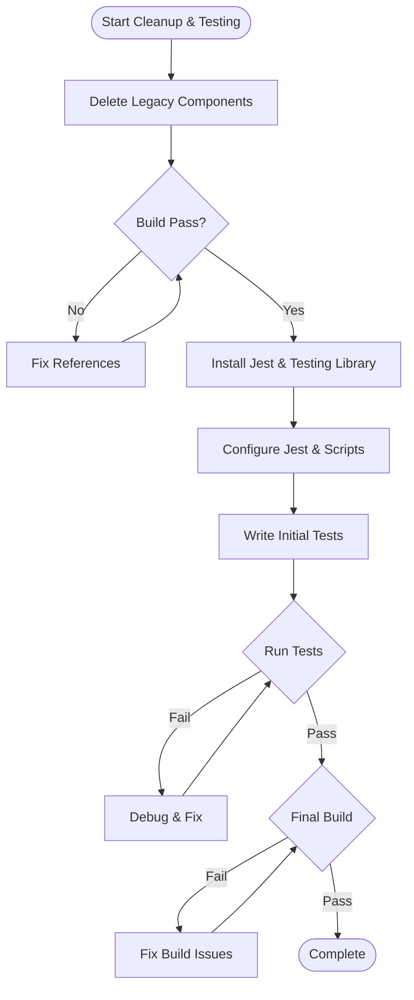

```mermaid
flowchart TD
    Start([Start Cleanup & Testing]) --> DeleteLegacy[Delete Legacy Components]
    DeleteLegacy --> BuildCheck1{Build Pass?}
    BuildCheck1 -- No --> FixRefs[Fix References]
    FixRefs --> BuildCheck1
    BuildCheck1 -- Yes --> InstallDeps[Install Jest & Testing Library]
    
    InstallDeps --> ConfigJest[Configure Jest & Scripts]
    ConfigJest --> WriteTests[Write Initial Tests]
    
    WriteTests --> RunTests{Run Tests}
    RunTests -- Fail --> DebugTests[Debug & Fix]
    DebugTests --> RunTests
    RunTests -- Pass --> FinalBuild{Final Build}
    
    FinalBuild -- Fail --> FixBuild[Fix Build Issues]
    FixBuild --> FinalBuild
    FinalBuild -- Pass --> Complete([Complete])
```
