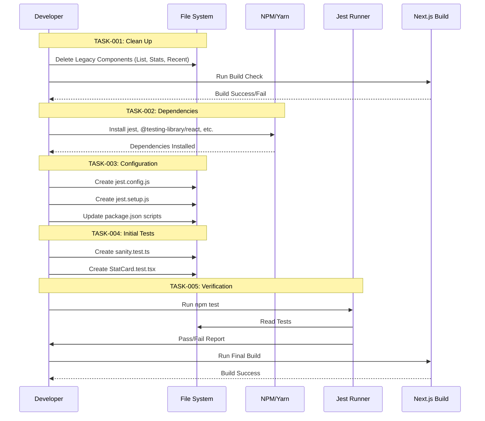

```mermaid
sequenceDiagram
    participant Dev as Developer
    participant FileSystem as File System
    participant NPM as NPM/Yarn
    participant Jest as Jest Runner
    participant Next as Next.js Build

    Note over Dev, FileSystem: TASK-001: Clean Up
    Dev->>FileSystem: Delete Legacy Components (List, Stats, Recent)
    Dev->>Next: Run Build Check
    Next-->>Dev: Build Success/Fail

    Note over Dev, NPM: TASK-002: Dependencies
    Dev->>NPM: Install jest, @testing-library/react, etc.
    NPM-->>Dev: Dependencies Installed

    Note over Dev, FileSystem: TASK-003: Configuration
    Dev->>FileSystem: Create jest.config.js
    Dev->>FileSystem: Create jest.setup.js
    Dev->>FileSystem: Update package.json scripts

    Note over Dev, FileSystem: TASK-004: Initial Tests
    Dev->>FileSystem: Create sanity.test.ts
    Dev->>FileSystem: Create StatCard.test.tsx

    Note over Dev, Jest: TASK-005: Verification
    Dev->>Jest: Run npm test
    Jest->>FileSystem: Read Tests
    Jest->>Dev: Pass/Fail Report
    Dev->>Next: Run Final Build
    Next-->>Dev: Build Success
```
