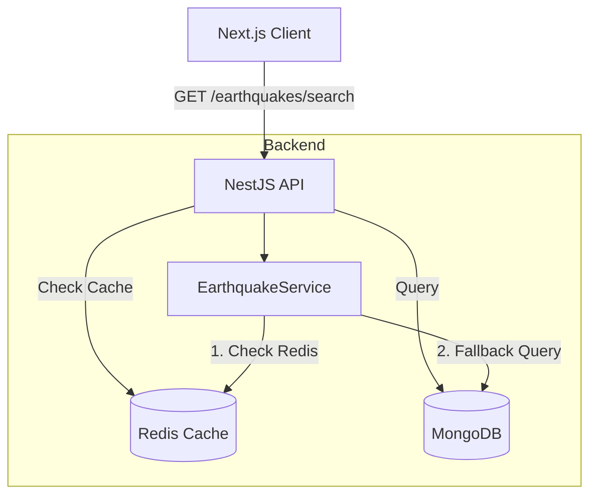

# Earthquake Search Feature Design

## 1. Architecture

The search feature follows a standard Client-Server architecture with caching optimizations.



## 2. API Contract

### Endpoint: `GET /earthquakes/search`
A dedicated endpoint to avoid breaking the existing `/earthquakes` endpoint used by the real-time dashboard.

**Query Parameters:**
| Param | Type | Required | Description |
|-------|------|----------|-------------|
| `q` | string | No | Text search for location/place |
| `minMag` | number | No | Minimum magnitude |
| `maxMag` | number | No | Maximum magnitude |
| `minDepth` | number | No | Minimum depth (km) |
| `maxDepth` | number | No | Maximum depth (km) |
| `startDate` | string | No | ISO Date string |
| `endDate` | string | No | ISO Date string |
| `page` | number | No | Page number (default: 1) |
| `limit` | number | No | Items per page (default: 20) |
| `sortBy` | string | No | Field to sort by (time, mag, depth) |
| `order` | string | No | 'asc' or 'desc' (default: desc) |

**Response Schema:**
```json
{
  "data": [
    {
      "id": "us1000...",
      "magnitude": 5.4,
      "location": { "place": "Japan", "coordinates": [...] },
      "depth": 10,
      "timestamp": "2023-10-01T12:00:00Z"
      // ... other fields
    }
  ],
  "meta": {
    "total": 150,
    "page": 1,
    "limit": 20,
    "totalPages": 8
  }
}
```

## 3. Database Design

### Schema
No changes to the `Earthquake` schema are required.

### Indexes
Ensure the following indexes exist in MongoDB to support performant filtering and sorting:
1.  `properties.mag`: For magnitude range queries.
2.  `properties.time`: For date range queries and sorting.
3.  `geometry.coordinates.2`: For depth queries (depth is usually the 3rd coordinate).
4.  `properties.place`: Text index for location search.

**Index Definition:**
```javascript
db.earthquakes.createIndex({ "properties.place": "text" });
db.earthquakes.createIndex({ "properties.mag": 1 });
db.earthquakes.createIndex({ "properties.time": -1 });
```

## 4. Frontend Design

### Components Structure
```
src/app/search/
├── page.tsx                # Main Search Page (Client Component)
└── components/
    ├── SearchForm.tsx      # Filters (Text, Range sliders, Date)
    ├── SearchResults.tsx   # List/Grid view of results
    ├── SearchMap.tsx       # Map visualization of results
    └── Pagination.tsx      # Pagination controls
```

### State Management
*   **URL as State**: The URL Query String will be the source of truth for search state. This ensures shareability and browser history support.
    *   Example: `/search?q=Japan&minMag=5&page=2`
*   **Data Fetching**:
    *   Use a custom hook `useEarthquakeSearch` that listens to `useSearchParams` and triggers the API call.
    *   Local state for `isLoading`, `data`, `error`, `meta`.

### User Interface
*   **Layout**:
    *   **Top**: Search bar and primary filters (Magnitude, Date).
    *   **Middle**: Toggle for "Advanced Filters" (Depth, etc.).
    *   **Content**: Split view (Desktop) or Tabbed view (Mobile) for List vs Map.
    *   **Bottom**: Pagination.

## 5. Testing Strategy

### Backend
1.  **Unit Tests**:
    *   Test `EarthquakeService.search()` for correct query construction.
    *   Test Redis caching logic (cache hit vs miss).
2.  **Integration Tests**:
    *   Test `GET /earthquakes/search` endpoint with various query combinations.
    *   Verify pagination metadata accuracy.

### Frontend
1.  **Component Tests**:
    *   `SearchForm`: Verify inputs update URL.
    *   `SearchResults`: Verify list renders correct data.
    *   `Pagination`: Verify clicking next/prev updates URL.
2.  **Integration Tests**:
    *   Mock API response and verify full search flow.

## 6. Deployment
1.  **Backend**: Deploy new endpoint (zero downtime).
2.  **Database**: Run index creation script.
3.  **Frontend**: Deploy new page.
