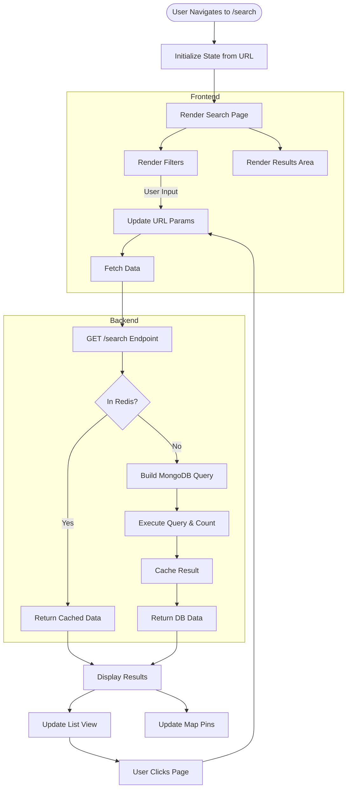

```mermaid
flowchart TD
    Start([User Navigates to /search]) --> Init[Initialize State from URL]
    Init --> Render[Render Search Page]
    
    subgraph Frontend
    Render --> Filters[Render Filters]
    Render --> Results[Render Results Area]
    
    Filters -->|User Input| UpdateURL[Update URL Params]
    UpdateURL --> Fetch[Fetch Data]
    end
    
    subgraph Backend
    Fetch --> API[GET /search Endpoint]
    API --> CheckCache{In Redis?}
    
    CheckCache -->|Yes| ReturnCache[Return Cached Data]
    CheckCache -->|No| BuildQuery[Build MongoDB Query]
    
    BuildQuery --> DBQuery[Execute Query & Count]
    DBQuery --> CacheResult[Cache Result]
    CacheResult --> ReturnDB[Return DB Data]
    end
    
    ReturnCache --> Display[Display Results]
    ReturnDB --> Display
    
    Display --> List[Update List View]
    Display --> Map[Update Map Pins]
    
    List --> Pagination[User Clicks Page]
    Pagination --> UpdateURL
```