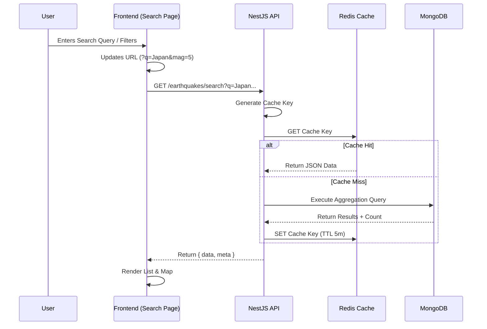

```mermaid
sequenceDiagram
    participant U as User
    participant FE as Frontend (Search Page)
    participant API as NestJS API
    participant R as Redis Cache
    participant DB as MongoDB

    U->>FE: Enters Search Query / Filters
    FE->>FE: Updates URL (?q=Japan&mag=5)
    FE->>API: GET /earthquakes/search?q=Japan...
    
    API->>API: Generate Cache Key
    API->>R: GET Cache Key
    
    alt Cache Hit
        R-->>API: Return JSON Data
    else Cache Miss
        API->>DB: Execute Aggregation Query
        DB-->>API: Return Results + Count
        API->>R: SET Cache Key (TTL 5m)
    end
    
    API-->>FE: Return { data, meta }
    FE->>FE: Render List & Map
```