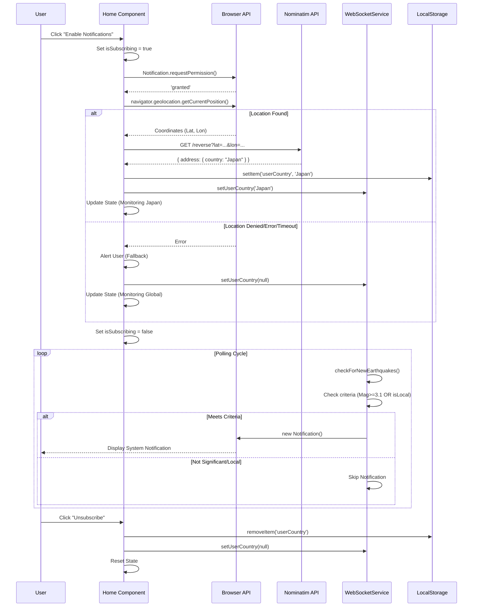

```mermaid
sequenceDiagram
    participant User
    participant UI as Home Component
    participant Browser as Browser API
    participant API as Nominatim API
    participant Service as WebSocketService
    participant Store as LocalStorage

    %% Subscription Flow
    User->>UI: Click "Enable Notifications"
    UI->>UI: Set isSubscribing = true
    UI->>Browser: Notification.requestPermission()
    Browser-->>UI: 'granted'
    
    UI->>Browser: navigator.geolocation.getCurrentPosition()
    alt Location Found
        Browser-->>UI: Coordinates (Lat, Lon)
        UI->>API: GET /reverse?lat=...&lon=...
        API-->>UI: { address: { country: "Japan" } }
        UI->>Store: setItem('userCountry', 'Japan')
        UI->>Service: setUserCountry('Japan')
        UI->>UI: Update State (Monitoring Japan)
    else Location Denied/Error/Timeout
        Browser-->>UI: Error
        UI->>UI: Alert User (Fallback)
        UI->>Service: setUserCountry(null)
        UI->>UI: Update State (Monitoring Global)
    end
    UI->>UI: Set isSubscribing = false

    %% Notification Trigger Flow
    loop Polling Cycle
        Service->>Service: checkForNewEarthquakes()
        Service->>Service: Check criteria (Mag>=3.1 OR isLocal)
        alt Meets Criteria
            Service->>Browser: new Notification()
            Browser-->>User: Display System Notification
        else Not Significant/Local
            Service->>Service: Skip Notification
        end
    end

    %% Unsubscribe Flow
    User->>UI: Click "Unsubscribe"
    UI->>Store: removeItem('userCountry')
    UI->>Service: setUserCountry(null)
    UI->>UI: Reset State
```
